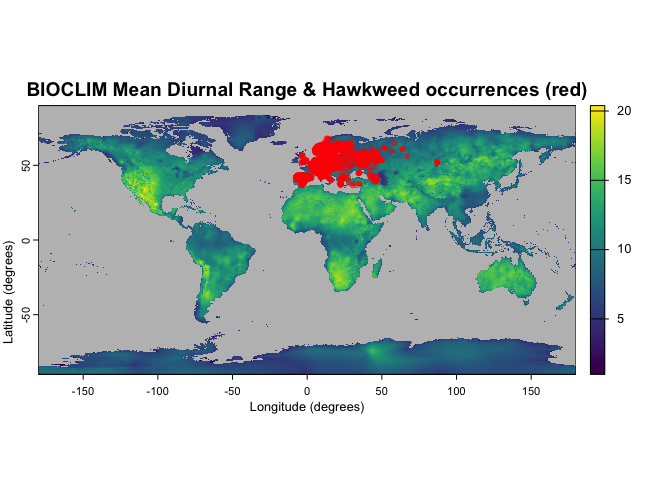
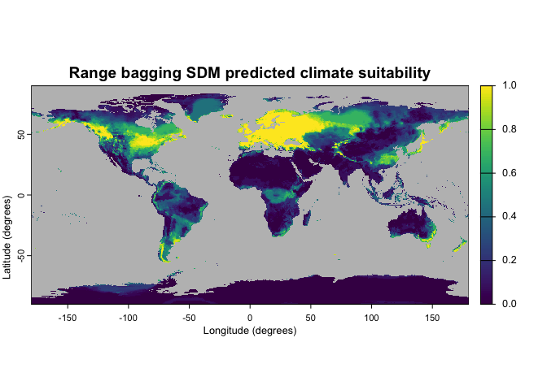
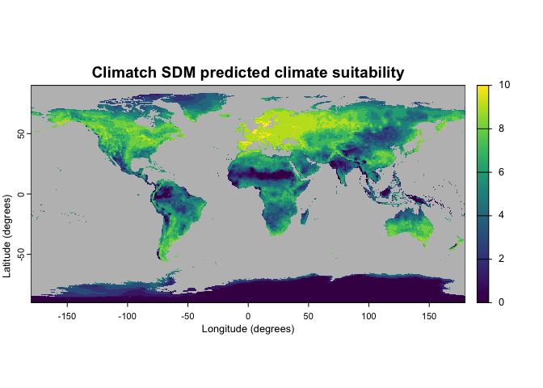

<!-- README.md is generated from README.Rmd. Please edit that file -->

# bssdm: Biosecurity Species Distribution Modelling

<!-- badges: start -->

[](https://github.com/cebra-analytics/bssdm/commits/main)
<!-- badges: end -->

The *bssdm* package provides Species Distribution Modelling (SDM)
implementations for two presence-only methods for predicting the spatial
distribution environmental suitability for exotic pests, diseases, and
other biosecurity threats, utilising spatial species occurrence records
and their corresponding environmental variables. The two methods are:

1.  Range bagging (Drake, 2015).
2.  Climatch (ABARES, 2020).

## Installation

You can install the latest version of *bssdm* from
[GitHub](https://github.com/) with:

``` r
remotes::install_github("cebra-analytics/bssdm")
```

## Example

The following example generates the environmental suitability for a
Hawkweed species (*Hieracium pilosella*), an exotic weed for Australia,
using both the *bssdm* package *Range bagging* and *Climatch* method
implementations.

### Step 1: Obtain environmental variables

The SDM requires spatial environmental data in the form of *GeoTIFF*
raster layers for the area of interest, encapsulating the species
occurrence records (to build the model), as well as locations where the
predicted environmental suitability is desired. Here we will use a
selection of global climate data from *WorldClim* (Fick & Hijmans, 2017;
<http://www.worldclim.org>).

``` r
# Climate WorldClim (BIOCLIM) data
# BIO02: Mean Diurnal Range
# BIO05; Max Temperature of Warmest Month
# BIO11: Mean Temperature of Coldest Quarter
# BIO12: Annual Precipitation
# BIO14: Precipitation of Driest Month
# BIO15: Precipitation Seasonality (Coefficient of Variation)
climate_rast <- terra::rast(sprintf("data/bioclim_10m/wc2.1bio%02d.tif",
                                    c(2,5,11,12,14,15)))
climate_rast
#> class       : SpatRaster 
#> size        : 1080, 2160, 6  (nrow, ncol, nlyr)
#> resolution  : 0.1666667, 0.1666667  (x, y)
#> extent      : -180, 180, -90, 90  (xmin, xmax, ymin, ymax)
#> coord. ref. : lon/lat WGS 84 (EPSG:4326) 
#> sources     : wc2.1bio02.tif  
#>               wc2.1bio05.tif  
#>               wc2.1bio11.tif  
#>               ... and 3 more sources
#> names       : wc2.1bio02, wc2.1bio05, wc2.1bio11, wc2.1bio12, wc2.1bio14, wc2.1bio15 
#> min values  :    1.00000,  -29.68600,  -66.31125,          0,          0,     0.0000 
#> max values  :   21.14754,   48.08275,   29.15299,      11191,        484,   229.0017
```

### Step 2: Obtain species occurrence records

The SDM requires species occurrence records to be specified in a table
with latitude and longitude coordinates using the WGS84 coordinate
reference system. Here we will use global Hawkweed (*Hieracium
pilosella*) occurrences downloaded from Global Biodiversity Information
Facility (GBIF, 2026).

It is recommended to firstly ‘clean’ occurrence records to remove
duplicates and incomplete or incorrect records via a tool such as
*CoordinateCleaner* (Zizka et al., 2019). We will use occurrence records
that were cleaned via *CoordinateCleaner*.

``` r
# Load cleaned Hawkweed (Hieracium pilosella) occurrences
occurrences_cleaned <- read.csv("data/hawkweed_occurrences_cleaned.csv")
head(occurrences_cleaned)
#>         lon      lat verified
#> 1  7.999168 44.85531        1
#> 2 14.782217 50.90555        1
#> 3 12.676944 50.66167        1
#> 4 12.431944 50.68472        1
#> 5 12.483333 50.70000        1
#> 6 12.506383 50.73638        1
# Plot BIOCLIM BIO02 & occurrences
terra::plot(climate_rast[[1]], colNA = "grey",
            main = "BIOCLIM Mean Diurnal Range & Hawkweed occurrences (red)",
            xlab = "Longitude (degrees)", ylab = "Latitude (degrees)")
terra::plot(terra::vect(occurrences_cleaned, crs = "EPSG:4326"),
            col = "red", pch = 20, alpha = 0.5, add = TRUE)
```



### Step 3: Run the SDM

To run a SDM we first build a model, then use it to predict the
suitability for the area of interest using climate data with matching
variables. Although this climate data may differ in its extent,
coordinate reference system (CRS), resolution, or time frame (e.g. past
or future climate), here we reuse the climate data used to build the
model. We will build models and predict suitability for both our *Range
bagging* and *Climatch* SDM methods.

``` r
# Run Range bagging SDM
rangebag_model <- bssdm::rangebag(climate_rast, occurrences_cleaned)
rangebag_output <- predict(rangebag_model, climate_rast, raw_output = FALSE)
# Run Climatch SDM
climatch_model <- bssdm::climatch(climate_rast, occurrences_cleaned)
climatch_output <- predict(climatch_model, climate_rast, raw_output = FALSE)
# Plot the SDM predicted climate suitability for each model
terra::plot(rangebag_output, colNA = "grey",
            main = "Range bagging SDM predicted climate suitability",
            xlab = "Longitude (degrees)", ylab = "Latitude (degrees)")
```



``` r
terra::plot(climatch_output, colNA = "grey",
            main = "Climatch SDM predicted climate suitability",
            xlab = "Longitude (degrees)", ylab = "Latitude (degrees)")
```



## References

ABARES (2020). ‘Climatch v2.0 User Manual’. Canberra.
<https://climatch.cp1.agriculture.gov.au/> Accessed: November 2021.

Drake, J. M. (2015). ‘Range bagging: a new method for ecological niche
modelling from presence-only data’. *Journal of the Royal Society
Interface*, 12(107), 20150086. <doi:10.1098/rsif.2015.0086>

Fick, S. E., Hijmans, R. J. (2017). ‘WorldClim 2: new 1-km spatial
resolution climate surfaces for global land areas’. *International
Journal of Climatology*, 37, 4302–4315. <doi:10.1002/joc.5086>

GBIF.org (04 May 2026) ‘GBIF Occurrence Download’.
<doi:10.15468/dl.q6q6fk>

Zizka, A., Silvestro, D., Andermann, T., Azevedo, J., Duarte Ritter, C.,
Edler, D., Farooq, H., Herdean, A., Ariza, M., Scharn, R., Svanteson,
S., Wengstrom, N., Zizka, V., & Antonelli, A. (2019).
‘CoordinateCleaner: standardized cleaning of occurrence records from
biological collection databases.’ *Methods in Ecology and Evolution*, 7.
<doi:10.1111/2041-210X.13152>, R package version 3.0.1,
<https://github.com/ropensci/CoordinateCleaner>.
